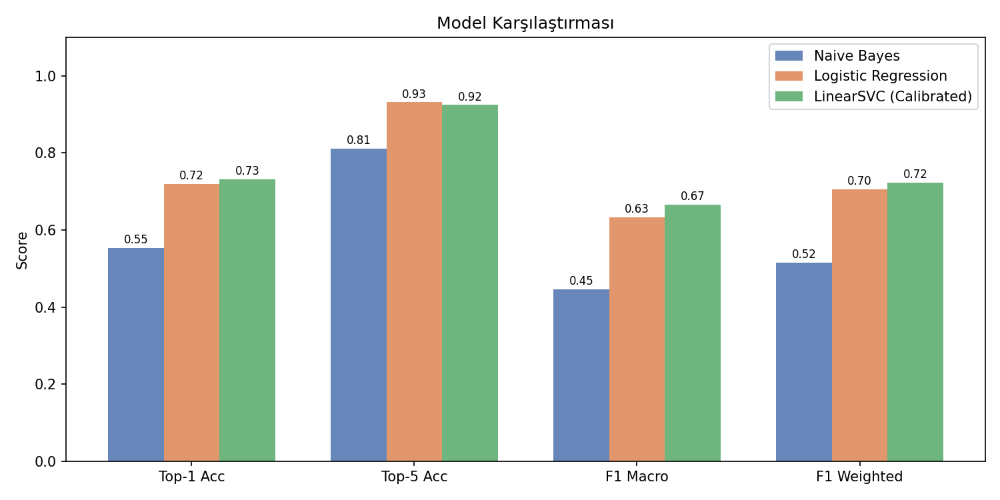
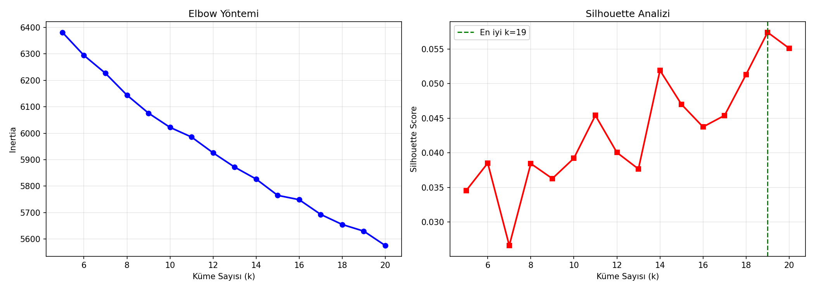
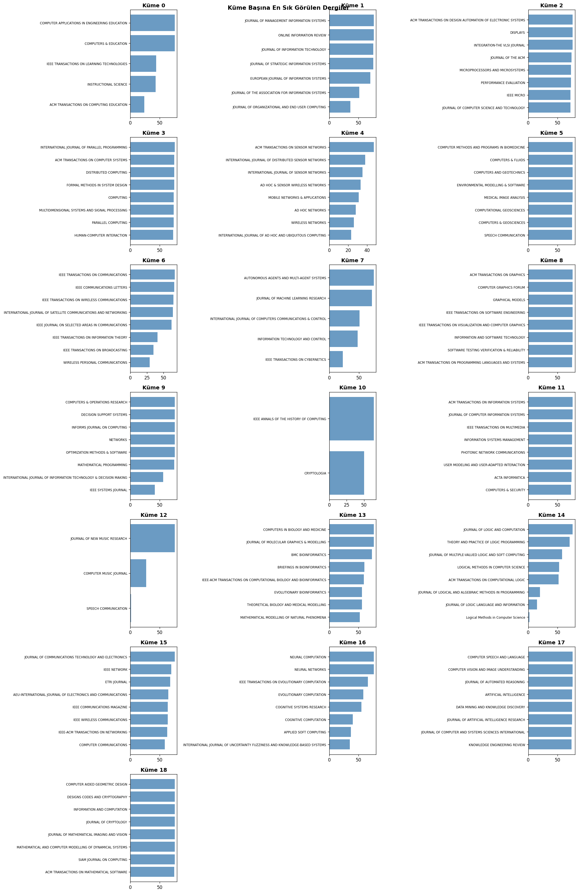
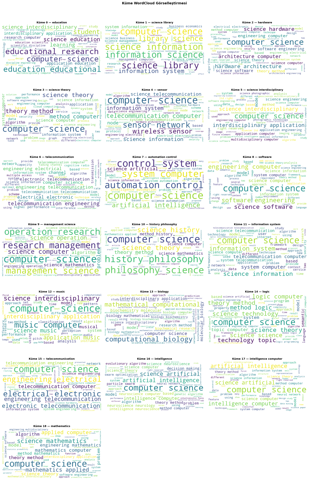
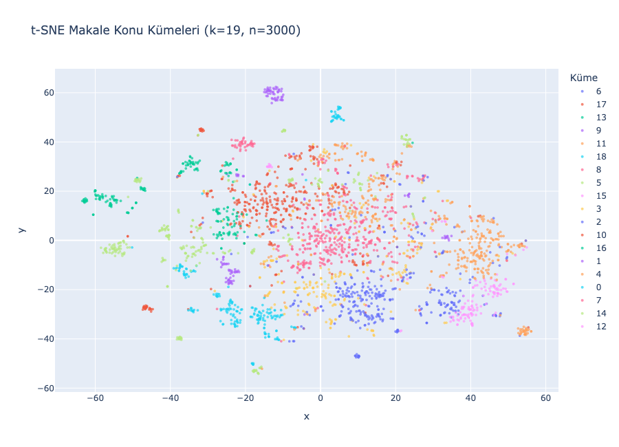

# 📚 Journal Finder — CS Article Recommender

> **Data Mining Final Project** | Computer Engineering  
> A machine learning system that recommends the **top-5 most relevant Computer Science journals** for a given article abstract.

---

## 📋 Table of Contents

- [Overview](#overview)
- [Dataset](#dataset)
- [Pipeline](#pipeline)
- [Models & Results](#models--results)
- [Clustering](#clustering)
- [Visualizations](#visualizations)
- [User Interface](#user-interface)
- [Project Structure](#project-structure)
- [Installation & Usage](#installation--usage)
- [Requirements](#requirements)

---

## Overview

Finding the right journal to submit an academic paper is a challenging and time-consuming task. This project implements an intelligent **journal recommendation system** tailored to Computer Science sub-disciplines using text mining and NLP techniques.

**Given an article abstract → returns top-5 most relevant journals with confidence scores.**

### Key Features
- 🔀 **Multi-source text fusion** — Combines abstracts, author keywords, WoS KeywordPlus terms, and WoS subject categories
- 🤖 **3-model comparison** — Naive Bayes, Logistic Regression, Calibrated LinearSVC
- 📊 **Top-5 accuracy of 0.93** with Logistic Regression
- 🔵 **19 thematic clusters** discovered via K-Means + Silhouette analysis
- 🖥️ **Interactive widget UI** built with `ipywidgets`

---

## Dataset

- **7,711 articles** from **175 Computer Science journals** (Web of Science)
- Stored in 9 relational CSV files

| File | Description |
|---|---|
| `AcademicRecord.csv` | Core article records |
| `AcademicRecordAbstract.csv` | Article abstracts |
| `Publication.csv` | Journal metadata (name, ISSN, DOI) |
| `AcademicKeyword.csv` / `AcademicRecordKeyword.csv` | Author-assigned keywords |
| `AcademicKeywordPlus.csv` / `AcademicRecordKeywordPlus.csv` | WoS KeywordPlus terms |
| `AcademicSubject.csv` / `AcademicRecordSubject.csv` | WoS subject categories |

---

## Pipeline

```
Raw CSV Tables
      │
      ▼
Multi-Source Text Fusion
  Abstract  +  2× AuthorKeywords  +  KeywordPlus  +  2× Subjects
      │
      ▼
Text Preprocessing
  HTML removal → Lowercase → Stopword removal → Lemmatization
      │
      ▼
TF-IDF Vectorization
  10,000 features | Unigram+Bigram | Sublinear TF | min_df=2
      │
      ├──────────────────────────┐
      ▼                          ▼
Classification                Clustering
(Naive Bayes,              (TruncatedSVD 300D
 Logistic Reg.,             → K-Means k=19
 LinearSVC)                 → t-SNE / WordCloud)
      │
      ▼
Top-5 Journal Recommendations
  with confidence scores
```

---

## Models & Results

Three classifiers were trained and evaluated on an 80/20 stratified split:

| Model | Top-1 Acc | Top-5 Acc | F1 Macro | F1 Weighted |
|---|---|---|---|---|
| Naive Bayes | 0.55 | 0.81 | 0.45 | 0.52 |
| Logistic Regression | 0.72 | **0.93** | 0.63 | 0.70 |
| LinearSVC (Calibrated) | **0.73** | 0.92 | **0.67** | **0.72** |



- **Logistic Regression** is used for the final recommendation interface due to its highest **Top-5 accuracy (0.93)** — the primary task metric.
- **5-Fold Cross-Validation** Top-1 accuracy: `0.72` (consistent with test set, confirming generalization).

---

## Clustering

K-Means clustering was applied on **TruncatedSVD-reduced (300D)** TF-IDF features. Optimal cluster count was determined by joint **Elbow + Silhouette** analysis over `k = 5..20`.



**Optimal k = 19** (Silhouette score = 0.057)

### Discovered Clusters

| ID | Theme | Representative Journals |
|---|---|---|
| 0 | Education | Computers & Education, ACM Trans. Computing Education |
| 1 | Science Library | J. Information Technology, Online Information Review |
| 2 | Hardware | ACM Trans. Design Automation, IEEE Micro |
| 3 | Science Theory | Formal Methods in System Design, Distributed Computing |
| 4 | Sensor Networks | ACM Trans. Sensor Networks, Int'l J. Distributed Sensor Netw. |
| 5 | Interdisciplinary | Computer Methods in Biomedicine, Computers & Geosciences |
| 6 | Telecommunications | IEEE Trans. Communications, IEEE Comm. Letters |
| 7 | Automation / Control | Autonomous Agents & Multi-Agent Systems, J. Machine Learning Res. |
| 8 | Software Engineering | ACM Trans. Graphics, IEEE Trans. Software Engineering |
| 9 | Management Science | Computers & Operations Research, Decision Support Systems |
| 10 | History / Philosophy | IEEE Annals History of Computing, Cryptologia |
| 11 | Information Systems | ACM Trans. Information Systems, IEEE Trans. Multimedia |
| 12 | Music / Acoustics | J. New Music Research, Computer Music Journal |
| 13 | Bioinformatics | Computers in Biology & Medicine, BMC Bioinformatics |
| 14 | Logic Programming | J. Logic and Computation, Theory & Practice of Logic Prog. |
| 15 | Electrical Telecom. | J. Comm. Tech. & Electronics, IEEE Network |
| 16 | Intelligence / Evol. | Neural Computation, IEEE Trans. Evolutionary Computation |
| 17 | Artificial Intelligence | Computer Speech & Language, Computer Vision & Image Und. |
| 18 | Mathematics | SIAM J. on Computing, ACM Trans. Mathematical Software |

---

## Visualizations

### Cluster Journal Distribution


### Cluster WordClouds


### t-SNE Interactive Plot


> 💡 Open `tsne_interactive.html` in your browser for the **interactive** version — hover over points to see journal names and cluster keywords.

---

## User Interface

An interactive recommendation widget built with `ipywidgets` inside the Jupyter Notebook.

**Empty state — paste your abstract:**


**Prediction output — top-5 journals with confidence bars:**


### How to use
1. Run all notebook cells
2. Paste your article abstract into the textarea (min. 50 characters)
3. Click **"🔍 En İyi 5 Dergiyi Bul"**
4. View the ranked journal list with color-coded confidence scores

---

## Project Structure

```
DataMiningFinalProject/
│
├── final_project_20210808002.ipynb   # Main notebook (full pipeline + UI)
│
├── Data Files (CSV)
│   ├── AcademicRecord.csv
│   ├── AcademicRecordAbstract.csv
│   ├── Publication.csv
│   ├── AcademicKeyword.csv
│   ├── AcademicRecordKeyword.csv
│   ├── AcademicKeywordPlus.csv
│   ├── AcademicRecordKeywordPlus.csv
│   ├── AcademicSubject.csv
│   └── AcademicRecordSubject.csv
│
└── Output Figures
    ├── model_comparison.png       # Model performance bar chart
    ├── elbow_silhouette.png       # Optimal k selection plots
    ├── cluster_journals.png       # Top journals per cluster
    ├── wordclouds.png             # WordCloud per cluster
    ├── newplot.png                # t-SNE static screenshot
    └── tsne_interactive.html      # Interactive t-SNE (open in browser)
```

---

## Installation & Usage

### 1. Clone the repository
```bash
git clone https://github.com/CenkerAydin/DataMiningFinalProject.git
cd DataMiningFinalProject
```

### 2. Install dependencies
```bash
pip install pandas numpy scikit-learn nltk beautifulsoup4 \
            matplotlib seaborn wordcloud plotly ipywidgets
```

### 3. Download NLTK data
```python
import nltk
nltk.download('stopwords')
nltk.download('wordnet')
nltk.download('omw-1.4')
```

### 4. Run the notebook
```bash
jupyter notebook final_project_20210808002.ipynb
```

Run all cells sequentially. The interactive UI will appear at the end of the notebook.

---

## Requirements

| Package | Version |
|---|---|
| Python | ≥ 3.8 |
| pandas | ≥ 1.3 |
| scikit-learn | ≥ 1.0 |
| nltk | ≥ 3.7 |
| beautifulsoup4 | ≥ 4.10 |
| matplotlib | ≥ 3.5 |
| wordcloud | ≥ 1.8 |
| plotly | ≥ 5.0 |
| ipywidgets | ≥ 7.6 |

---

## Author

**Cenker Aydın** — Student ID: 20210808002  
Computer Engineering Department  
Data Mining Final Project — 2026
